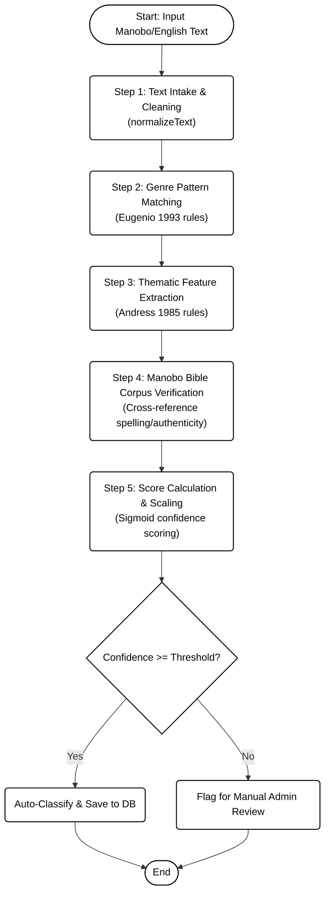

# ManoboLit Archive - Project Plan

## Project Overview
A web-based, responsive rule-based classification and retrieval system for digitally preserving, classifying, and enabling intelligent multi-dimensional retrieval of documented Agusan Manobo oral literature and folk songs.

## Technical Architecture

### System Architecture Diagram

The system architecture of the ManoboLit Archive is divided into three key layers: Client Layer, Server Layer, and Data & Storage Layer. Here is the architecture mapping formatted in a clean, black-and-white style:

```mermaid
graph LR
    subgraph Client Layer (Responsive UI)
        Pages("React / Next.js Pages<br/>(Archive, Dashboard, Admin)")
    end

    subgraph Server Layer (Next.js API Routes)
        Handler("API Controller Route Handler")
        Engine("Rule-Based Classification Engine<br/>(Eugenio & Andress Rules)")
    end

    subgraph Data & Storage Layer
        Prisma("Prisma ORM Client")
        DB[("SQLite / PostgreSQL Database")]
        FS("Local Filesystem<br/>(/public/audio/ folk songs)")
    end

    Pages <--> |JSON API Requests| Handler
    Handler --> Engine
    Handler --> Prisma
    Engine --> Prisma
    Prisma <--> DB
    FS --> |Stream Audio| Pages

    %% Style Rules (Pure Black & White, matching reference layout)
    classDef default fill:#ffffff,stroke:#000000,stroke-width:1.5px,color:#000000;
    classDef container fill:#ffffff,stroke:#000000,stroke-width:1.5px,color:#000000;

    class Pages,Handler,Engine,Prisma,DB,FS container;

    style "Client Layer (Responsive UI)" fill:#ffffff,stroke:#000000,stroke-dasharray: 5 5,color:#000000
    style "Server Layer (Next.js API Routes)" fill:#ffffff,stroke:#000000,stroke-dasharray: 5 5,color:#000000
    style "Data & Storage Layer" fill:#ffffff,stroke:#000000,stroke-dasharray: 5 5,color:#000000
```

A generated high-resolution version of this diagram is saved in the project files at [system_architecture_diagram.png](file:///c:/Users/admin/Downloads/ManoboLit-Archive/system_architecture_diagram.png).

### Tech Stack
- **Frontend Framework**: Next.js 14 (React 18) with TypeScript
- **UI Components**: shadcn/ui (Radix UI primitives)
- **Styling**: TailwindCSS
- **Icons**: Lucide React
- **Charts**: Recharts or Chart.js
- **Audio Processing**: Howler.js or HTML5 Audio API
- **State Management**: React Context + Zustand
- **Database**: PostgreSQL with Prisma ORM
- **File Storage**: Local filesystem or cloud storage (AWS S3/Azure Blob)
- **Search**: PostgreSQL Full-Text Search or Elasticsearch
- **Authentication**: NextAuth.js (if needed)

### Project Structure
```
ManoboLit-Archive/
├── app/                      # Next.js app directory
│   ├── (auth)/              # Auth routes
│   ├── archive/             # Main archive interface
│   ├── dashboard/           # Analytics dashboard
│   ├── admin/               # Admin panel for CRUD
│   └── api/                 # API routes
├── components/              # React components
│   ├── ui/                  # shadcn/ui components
│   ├── archive/             # Archive-specific components
│   ├── audio/               # Audio player components
│   ├── search/              # Search/filter components
│   └── dashboard/           # Dashboard components
├── lib/                     # Utility functions
│   ├── classification/      # Rule-based classification engine
│   ├── database/            # Prisma client
│   └── utils/               # Helper functions
├── public/                  # Static assets
│   └── audio/               # Audio file storage
├── prisma/                  # Database schema
└── types/                   # TypeScript types
```

## Database Schema Design

### Core Tables

```prisma
// Literature Entry
model LiteratureEntry {
  id                String   @id @default(cuid())
  title             String
  manoboTitle       String?
  englishTitle      String?
  type              EntryType // ORAL_LITERATURE or FOLK_SONG
  content           String   @db.Text
  transcription     String?  @db.Text
  translation       String?  @db.Text
  audioFile         String?
  audioDuration     Int?
  source            String   // Catipay & Curato (2024) or Maravilla (2024)
  yearCollected     Int?
  narrator          String?
  communityLocation String
  province          String
  municipality      String
  barangay          String?
  
  // Classification fields
  genre             Genre
  theme             Theme[]
  culturalElements  String[]
  
  // Metadata
  createdAt         DateTime @default(now())
  updatedAt         DateTime @updatedAt
  createdBy         String?
  
  classifications   Classification[]
}

// Classification Results
model Classification {
  id                String   @id @default(cuid())
  entryId           String
  entry             LiteratureEntry @relation(fields: [entryId], references: [id])
  
  classifiedGenre   Genre
  classifiedTheme   Theme[]
  confidenceScore   Float
  rulesApplied      String[] // List of rule IDs that matched
  timestamp         DateTime @default(now())
}

// Reference Corpus (Manobo Bible Agusan)
model ReferenceCorpus {
  id                String   @id @default(cuid())
  text              String   @db.Text
  source            String   // "Manobo Bible Agusan"
  category          String?
  metadata          Json?
}

enum EntryType {
  ORAL_LITERATURE
  FOLK_SONG
}

enum Genre {
  // Eugenio (1993) Taxonomy
  MYTH
  LEGEND
  FOLKTALE
  EPIC
  RIDDLE
  PROVERB
  SONG
  CHANT
  PRAYER
  INCANTATION
}

enum Theme {
  // Andress (1985) Thematic Categories
  CREATION_MYTHS
  HEROIC_DEEDS
  COURTSHIP_AND_MARRIAGE
  AGRICULTURAL_CYCLES
  HUNTING_AND_FISHING
  DEATH_AND_AFTERLIFE
  SPIRIT_WORLD
  NATURE_AND_ENVIRONMENT
  SOCIAL_CUSTOMS
  MORAL_LESSONS
  HISTORICAL_EVENTS
  SUPERNATURAL_BEINGS
}
```

## Rule-Based Classification Engine

### Classification Pipeline Flowchart

Here is the visual workflow of the rule-based classification and verification engine, structured in the standard evaluation/testing format (black-and-white layout with rounded process rectangles, oval start/end points, and a diamond decision node):



A generated high-resolution version of this flowchart is saved in the project files at [classification_pipeline_flowchart.png](file:///c:/Users/admin/Downloads/ManoboLit-Archive/classification_pipeline_flowchart.png).

### Classification Rules Structure

```typescript
interface ClassificationRule {
  id: string;
  name: string;
  type: 'GENRE' | 'THEME';
  framework: 'EUGENIO_1993' | 'ANDRESS_1985';
  patterns: Pattern[];
  confidence: number;
}

interface Pattern {
  keyword: string[];
  phrase: string[];
  semantic: string[];
  context: string[];
}
```

### Eugenio (1993) Genre Classification Rules

**Myth Rules:**
- Keywords: "creation", "origin", "beginning", "first", "gods", "deities"
- Phrases: "in the beginning", "when the world was", "the first people"
- Context: Explains natural phenomena, cosmic origins

**Legend Rules:**
- Keywords: "hero", "supernatural", "spirit", "mountain", "lake origin"
- Phrases: "it is said that", "according to legend", "the story goes"
- Context: Historical events with supernatural elements

**Folktale Rules:**
- Keywords: "animal", "trickster", "moral", "lesson", "clever"
- Phrases: "once upon a time", "long ago", "in a village"
- Context: Entertainment with moral lessons

**Epic Rules:**
- Keywords: "warrior", "battle", "journey", "quest", "conquest"
- Phrases: "the great warrior", "embarked on a journey"
- Context: Heroic narratives, cultural values

### Andress (1985) Theme Classification Rules

**Creation Myths:**
- Keywords: "created", "formed", "made", "birth", "emerged"
- Semantic: Origin stories, cosmological narratives

**Heroic Deeds:**
- Keywords: "brave", "courageous", "defeated", "conquered", "victory"
- Semantic: Acts of bravery, overcoming obstacles

**Courtship and Marriage:**
- Keywords: "love", "marry", "wedding", "courtship", "betrothal"
- Semantic: Romantic narratives, marriage customs

**Agricultural Cycles:**
- Keywords: "harvest", "planting", "rice", "crops", "farming"
- Semantic: Agricultural practices, seasonal rituals

**Hunting and Fishing:**
- Keywords: "hunt", "fish", "catch", "trap", "forest", "river"
- Semantic: Subsistence activities, traditional occupations

## Module Specifications

### 1. Digital Archiving Module
**Features:**
- CRUD operations for literature entries
- Audio file upload and management
- Metadata entry forms
- Bulk import functionality
- Export capabilities (JSON, CSV)

**Components:**
- EntryForm (create/edit)
- EntryList (view all)
- EntryDetail (single entry view)
- AudioUploader (file upload)
- MetadataEditor (structured metadata input)

### 2. Rule-Based Classification Engine
**Features:**
- Automatic genre classification
- Automatic theme classification
- Pattern matching algorithm
- Confidence scoring
- Rule management interface
- Manual override capability

**Components:**
- ClassificationEngine (core logic)
- RuleManager (admin interface)
- ClassificationViewer (results display)
- ConfidenceMeter (visual score)

### 3. Audio Playback Module
**Features:**
- Audio player with controls
- Waveform visualization
- Playback speed control
- Timestamp markers
- Transcript synchronization

**Components:**
- AudioPlayer (main player)
- WaveformVisualizer (audio waveform)
- PlaybackControls (play/pause/speed)
- TranscriptViewer (synchronized text)

### 4. Search and Filter Module
**Features:**
- Keyword search with autocomplete
- Multi-dimensional filtering (genre, theme, location)
- Advanced search operators
- Search history
- Saved searches

**Components:**
- SearchBar (input with autocomplete)
- FilterPanel (multi-select filters)
- SearchResults (results display)
- AdvancedSearch (complex queries)

### 5. Analytics Dashboard
**Features:**
- Genre distribution chart
- Theme frequency chart
- Geographic distribution map
- Entry statistics
- Classification accuracy metrics
- User activity analytics

**Components:**
- DashboardOverview (summary stats)
- GenreChart (pie/bar chart)
- ThemeChart (frequency chart)
- LocationMap (geographic visualization)
- ClassificationMetrics (accuracy reports)

## Responsive Design Strategy

### Breakpoints
- **Mobile**: < 640px (sm)
- **Tablet**: 640px - 1024px (md, lg)
- **Desktop**: > 1024px (xl, 2xl)

### Mobile-First Approach
1. **Navigation**: Bottom tab bar for mobile, sidebar for desktop
2. **Layout**: Single column on mobile, multi-column on larger screens
3. **Audio Player**: Compact mode on mobile, expanded on desktop
4. **Dashboard**: Card-based layout, stack vertically on mobile
5. **Search**: Full-width on mobile, sidebar on desktop

### Touch Optimization
- Larger touch targets (min 44px)
- Swipe gestures for audio playback
- Pull-to-refresh for entry lists
- Haptic feedback support

## Implementation Phases

A generated high-resolution version of the project Gantt chart schedule is saved in the project files at [gantt_chart.png](file:///c:/Users/admin/Downloads/ManoboLit-Archive/gantt_chart.png).

### Phase 1: Foundation (Weeks 1-2)
- Set up Next.js project with TypeScript
- Configure TailwindCSS and shadcn/ui
- Design and implement database schema
- Set up Prisma ORM
- Create basic project structure

### Phase 2: Core Archiving (Weeks 3-4)
- Implement CRUD operations for literature entries
- Build entry forms and validation
- Create entry list and detail views
- Implement audio file upload
- Add metadata management

### Phase 3: Classification Engine (Weeks 5-6)
- Design classification rule structure
- Implement pattern matching algorithm
- Create genre classification rules (Eugenio 1993)
- Create theme classification rules (Andress 1985)
- Build classification interface
- Add confidence scoring

### Phase 4: Search and Filter (Weeks 7-8)
- Implement keyword search
- Build multi-dimensional filters
- Add advanced search functionality
- Create search results display
- Implement search optimization

### Phase 5: Audio Playback (Weeks 9)
- Build audio player component
- Add waveform visualization
- Implement playback controls
- Add transcript synchronization
- Optimize for mobile

### Phase 6: Analytics Dashboard (Weeks 10-11)
- Create dashboard layout
- Implement genre distribution chart
- Build theme frequency chart
- Add geographic distribution
- Create statistical reports
- Add classification metrics

### Phase 7: Data Entry (Weeks 12-13)
- Archive 17 oral literature pieces
- Archive 5 folk songs
- Add complete metadata
- Tag with genres and themes
- Upload audio files
- Validate classifications

### Phase 8: Integration and Testing (Weeks 14-15)
- Integrate all modules
- Perform end-to-end testing
- Fix bugs and issues
- Optimize performance
- Test responsive design

### Phase 9: Evaluation (Weeks 16-17)
- Create evaluation instrument
- Conduct user testing
- Gather feedback
- Measure performance metrics
- Document results

## Evaluation Framework

### Evaluation Criteria
1. **Functional Suitability**
   - Completeness of features
   - Accuracy of classification
   - Search effectiveness
   - Audio playback quality

2. **Usability**
   - Ease of use
   - Navigation clarity
   - Mobile responsiveness
   - Learnability

3. **Reliability**
   - System stability
   - Error handling
   - Data integrity
   - Performance consistency

4. **Cultural Accuracy**
   - Classification accuracy
   - Metadata completeness
   - Cultural sensitivity
   - Linguistic accuracy

### Target Users
- Manobo community members
- Researchers and scholars
- Cultural preservationists
- Students and educators
- General public

### System Use Case Diagram

The following UML Use Case diagram maps the system boundary, actors (Guest / Scholar and Administrator), and system use cases in a clean, black-and-white style:

```mermaid
graph LR
    classDef actor fill:#ffffff,stroke:#000000,stroke-width:1.5px,color:#000000;
    classDef usecase fill:#ffffff,stroke:#000000,stroke-width:1.5px,color:#000000;

    Guest((Guest / Scholar))
    Admin((Administrator))

    subgraph ManoboLit Archive System
        Browse(["Browse & Search Archive"])
        Play(["Play Folk Songs with Synced Lyrics"])
        Lexicon(["Lookup Words in Lexicon"])
        Analytics(["View Analytics Dashboard"])
        Export(["Export Heritage Records<br/>(CSV/JSON)"])
        Manage(["Manage Entries (CRUD)"])
        Override(["Override Engine<br/>Classifications"])
    end

    %% Solid association lines without arrowheads
    Guest --- Browse
    Guest --- Play
    Guest --- Lexicon
    Guest --- Analytics

    Admin --- Browse
    Admin --- Play
    Admin --- Lexicon
    Admin --- Analytics
    Admin --- Export
    Admin --- Manage
    Admin --- Override

    class Guest,Admin actor;
    class Browse,Play,Lexicon,Analytics,Export,Manage,Override usecase;
    
    style "ManoboLit Archive System" fill:#ffffff,stroke:#000000,stroke-width:1.5px,color:#000000;
```

A generated high-resolution version of this UML Use Case diagram is saved in the project files at [system_use_case_diagram.png](file:///c:/Users/admin/Downloads/ManoboLit-Archive/system_use_case_diagram.png).

## Success Metrics
- Classification accuracy > 85%
- User satisfaction score > 4/5
- System uptime > 99%
- Average search response time < 2 seconds
- Mobile usability score > 90%

## Risk Mitigation
- **Data loss**: Regular backups, version control
- **Classification errors**: Manual review process, rule refinement
- **Performance issues**: Database optimization, caching
- **Accessibility**: WCAG 2.1 compliance testing
- **Cultural sensitivity**: Community consultation, expert review
